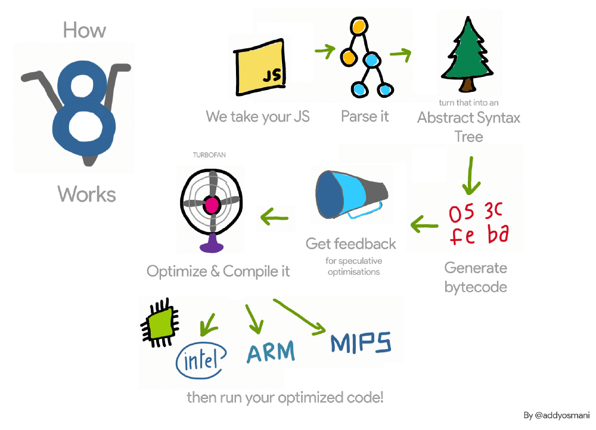

# 前端性能(https://medium.com/reloading/javascript-start-up-performance-69200f43b201)

## v8解析js

> 浏览器一旦下载了脚本就会parse,interpret & run
> 
> Parsing, Compiling and Executing是js引擎在启动阶段花的时间最多的阶段
> 

## 如何降低js的解析时间
- 减少js的大小
- 代码拆分
- 脚本流(async/defer)
- 时间测试
